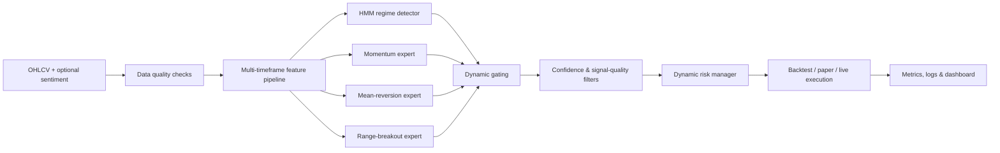

# Regime-Aware AI Crypto Trading System

[](https://github.com/pl1201/regime-aware-ai-trading/actions/workflows/ci.yml)
[](https://www.python.org/)
[](#ai-and-mathematical-methods)
[](#execution-and-safety)
[](LICENSE)

An end-to-end quantitative research and automated trading platform for crypto
markets. The system combines **regime detection**, a **dynamic
Mixture-of-Experts (MoE)**, multi-timeframe features, walk-forward validation,
and risk-aware execution in a single Python codebase.

> This is an engineering and quantitative-research project, not financial
> advice. Live trading is disabled until credentials and an explicit live-mode
> configuration are provided. Start in paper/demo mode.

## Why this project is technically interesting

- **Regime-aware inference:** a Gaussian Hidden Markov Model estimates latent
  market states instead of assuming one stationary data-generating process.
- **Dynamic MoE:** specialist models for momentum breakout, mean reversion, and
  range behavior are weighted by a learned/contextual gating layer.
- **Leakage-conscious validation:** chronological splits and walk-forward
  evaluation preserve the direction of time.
- **Multi-timeframe context:** lower-timeframe microstructure is conditioned on
  higher-timeframe trend, momentum, volatility, and seasonality.
- **Production safety:** position limits, stop-loss/take-profit logic, daily-loss
  and consecutive-loss circuit breakers, exchange abstraction, and demo mode.
- **Reproducible evaluation:** CAGR, Sharpe, Sortino, Calmar, volatility,
  drawdown, win rate, profit factor, and signal coverage.

## System architecture



The reusable research package lives in `algo_trading/`; the deployable,
production-oriented implementation lives in `production/`.

## AI and mathematical methods

### 1. Hidden-state market regimes

For an observation vector \(x_t\) built from returns, volatility, trend
strength, and volume features, the HMM models:

\[
P(z_t \mid z_{t-1}) = A_{z_{t-1},z_t},
\qquad
x_t \mid z_t=k \sim \mathcal{N}(\mu_k,\Sigma_k)
\]

The inferred state \(z_t\) is mapped to interpretable conditions such as
trending, ranging, volatile, and calm. The detector is fit on training data
only; deterministic ADX/volatility rules provide a fallback.

### 2. Dynamic Mixture-of-Experts

Each expert \(f_k(x_t)\) specializes in a different market behavior. The final
class distribution is a convex combination:

\[
\hat{p}(y_t \mid x_t)
= \sum_{k=1}^{K} g_k(x_t,z_t)\,f_k(x_t),
\qquad
g_k \ge 0,\quad \sum_k g_k=1
\]

Regime probabilities and multi-timeframe context influence the gate. The
implementation supports gradient-boosting families including XGBoost,
LightGBM, CatBoost, and scikit-learn estimators, with explicit feature alignment
between training and inference.

### 3. Labels, imbalance, and decision thresholds

Forward-return labels use a horizon \(h\) and a neutral band \(\tau\):

\[
y_t =
\begin{cases}
+1 & r_{t,t+h} > \tau \\
-1 & r_{t,t+h} < -\tau \\
0  & \text{otherwise}
\end{cases}
\]

The training pipeline provides class-weighting, optional SMOTE-based
resampling, focal-loss components, probability calibration/thresholding, and
regime-specific decision rules. Transaction costs are included when evaluating
signal thresholds.

### 4. Risk and performance mathematics

Position sizing is bounded by account risk and stop distance:

\[
q_t = \min\left(q_{\max},
\frac{E_t \rho_t}{|P_{\text{entry}}-P_{\text{stop}}|}\right)
\]

where \(E_t\) is equity and \(\rho_t\) is dynamically adjusted by volatility,
regime, and portfolio limits. Evaluation includes:

\[
\text{Sharpe}=\frac{\mathbb{E}[R_t-R_f]}{\sigma(R_t)}\sqrt{N},
\quad
\text{Sortino}=\frac{\mathbb{E}[R_t-R_f]}{\sigma_-(R_t)}\sqrt{N},
\quad
\text{Calmar}=\frac{\text{CAGR}}{|\text{MDD}|}
\]

See [the regime strategy overview](docs/REGIME_STRATEGY_OVERVIEW.md) and
[production architecture](PRODUCTION_ARCHITECTURE_IO.md) for the deeper design.

## Repository map

| Path | Purpose |
|---|---|
| `algo_trading/` | Reusable indicators, strategies, backtests, risk, live execution, visualization |
| `production/` | Production-oriented MoE/HMM pipeline, smoke test, deployment entry points |
| `train/` | Feature engineering, labeling, imbalance handling, threshold scoring |
| `backtest/` | Research and evaluation runners |
| `tests/` | Metrics, strategy, circuit-breaker, and model compatibility tests |
| `scripts/` | Training, walk-forward, data, audit, and reporting utilities |
| `visualization/` | Architecture and model-explanation graphics |
| `docs/` | Design decisions, ML features, regime strategy, operational guides |

## Quick start

Requires Python 3.11+.

```bash
git clone https://github.com/pl1201/regime-aware-ai-trading.git
cd regime-aware-ai-trading
python -m venv .venv
```

Windows:

```powershell
.\.venv\Scripts\Activate.ps1
python -m pip install --upgrade pip
pip install -r requirements.txt
Copy-Item .env.example .env
python tests/run_quick_tests.py
```

Linux/macOS:

```bash
source .venv/bin/activate
python -m pip install --upgrade pip
pip install -r requirements.txt
cp .env.example .env
python tests/run_quick_tests.py
```

Run the dashboard or inspect the CLI:

```bash
streamlit run dashboard_moe_v2.py
python -m algo_trading.main --help
```

For the production package:

```bash
cd production
cp .env.example .env
python smoke_test_production.py
python start_trading_bot.py dry-run
```

## Validation philosophy

Random train/test splitting is inappropriate for this problem. The project uses
chronological holdouts and contiguous walk-forward folds:

```text
Fold 1: [ train ........ ] [ validate ]
Fold 2: [ train ................ ] [ validate ]
Fold 3: [ train ........................ ] [ validate ]
```

Models are assessed on both predictive and trading behavior. A candidate must
show stability across periods—not merely a strong aggregate result. Generated
model binaries, private datasets, logs, and runtime outputs are intentionally
excluded from Git.

## Execution and safety

- Keep `MODE=paper` and `OKX_USE_SIMULATED_TRADING=1` during development.
- Secrets belong only in local `.env` files; `.env.example` documents keys
  without values.
- Circuit breakers stop new orders after daily-loss, cumulative-loss, or
  consecutive-loss limits.
- Exchange calls are isolated behind adapters; risk checks run before order
  submission.
- No historical result guarantees future performance.

See [SECURITY.md](SECURITY.md) before connecting an exchange account.

## Engineering roadmap

- [x] Vectorized and event-driven backtesting
- [x] HMM regime detection with fallback rules
- [x] Dynamic MoE and multi-timeframe feature context
- [x] Walk-forward and segment-level evaluation
- [x] Risk circuit breakers and paper/live execution modes
- [x] CI quick tests and production smoke tests
- [ ] Experiment tracking and model registry
- [ ] Containerized deployment and observability stack
- [ ] Drift detection with automated challenger evaluation

## License

Released under the [MIT License](LICENSE).
