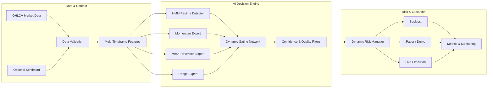

<div align="center">

# Regime-Aware AI Crypto Trading System

**A production-oriented quantitative trading platform combining market-regime
inference, Dynamic Mixture-of-Experts, multi-timeframe features, walk-forward
validation, and risk-controlled execution.**

[](https://github.com/pl1201/regime-aware-ai-trading/actions/workflows/ci.yml)
[](https://github.com/pl1201/regime-aware-ai-trading/actions/workflows/production-smoke.yml)
[](https://www.python.org/)
[](#ai-and-mathematical-foundations)
[](#production-and-safety)
[](LICENSE)

[Architecture](#system-architecture) ·
[AI & Mathematics](#ai-and-mathematical-foundations) ·
[Validation](#validation-and-research-integrity) ·
[Quick Start](#quick-start) ·
[Production](#production-and-safety)

</div>

---

## Overview

This repository implements the complete lifecycle of an AI-assisted crypto
trading system:

1. ingest and validate OHLCV market data;
2. construct leakage-safe, multi-timeframe features;
3. infer latent market regimes with a Hidden Markov Model;
4. combine specialist strategies through a Dynamic Mixture-of-Experts;
5. filter low-quality signals and size positions under explicit risk limits;
6. evaluate models with chronological walk-forward tests;
7. execute in backtest, paper, demo, or live environments.

The emphasis is not only predictive accuracy. The system is designed around
**out-of-sample stability, transaction-aware evaluation, execution safety, and
reproducibility**.

> [!CAUTION]
> This is a quantitative engineering and research project, not financial
> advice. Historical performance does not guarantee future results. Keep the
> system in paper/demo mode until every exchange and risk setting has been
> independently verified.

## Core capabilities

| Area | Implementation |
|---|---|
| Market intelligence | Gaussian HMM regime inference with deterministic fallback rules |
| AI ensemble | Dynamic Mixture-of-Experts with regime-aware gating |
| Expert models | Momentum breakout, mean reversion, and range behavior |
| ML ecosystem | XGBoost, LightGBM, CatBoost, scikit-learn, optional PyTorch sequence features |
| Feature engineering | Trend, momentum, volatility, volume, seasonality, and multi-timeframe context |
| Validation | Chronological holdout, walk-forward folds, market-segment analysis, stress tests |
| Risk management | Volatility-aware sizing, SL/TP, exposure limits, circuit breakers |
| Execution | OKX and Binance adapters, paper/demo mode, live-trading controls |
| Observability | Metrics, structured logs, Telegram notifications, Streamlit dashboard |

## System architecture



The main reusable library is in `algo_trading/`. The deployment-oriented
implementation, smoke tests, and operational entry points are in `production/`.

## AI and mathematical foundations

### 1. Hidden-state market regimes

Financial time series are non-stationary: a model that works in a trending
market may fail in a ranging or high-volatility market. The system therefore
models a latent market state $z_t$ from an observation vector $x_t$ containing
returns, trend strength, volatility, and volume information.

The state-transition and observation models are:

$$
P(z_t \mid z_{t-1}) = A_{z_{t-1},z_t}
$$

$$
x_t \mid z_t = k \sim \mathcal{N}(\mu_k, \Sigma_k)
$$

Inferred states are mapped to interpretable conditions such as **trending**,
**ranging**, **volatile**, and **calm**. The HMM is fitted on training data only
to prevent future information from leaking into historical predictions.
ADX- and volatility-based rules provide a deterministic fallback when the HMM
is unavailable.

### 2. Dynamic Mixture-of-Experts

A single global model is rarely optimal across all market conditions. The
system uses $K$ specialist models, where expert $f_k(x_t)$ learns a distinct
behavior. A gating function assigns contextual weights using features and
regime information:

$$
\hat{p}(y_t \mid x_t)
=
\sum_{k=1}^{K}
g_k(x_t, z_t)\,f_k(x_t)
$$

subject to:

$$
g_k(x_t,z_t) \ge 0,
\qquad
\sum_{k=1}^{K} g_k(x_t,z_t) = 1
$$

This design allows the final decision to adapt continuously rather than switch
between strategies through brittle hard-coded rules. Explicit feature
alignment protects inference from missing, reordered, or additional columns.

### 3. Forward-return labels

Training targets are derived from a future return over horizon $h$:

$$
r_{t,t+h} = \frac{P_{t+h}}{P_t} - 1
$$

A neutral band $\tau$ separates actionable moves from market noise:

$$
y_t =
\begin{cases}
+1, & r_{t,t+h} > \tau \\
0,  & \lvert r_{t,t+h} \rvert \le \tau \\
-1, & r_{t,t+h} < -\tau
\end{cases}
$$

The training pipeline includes class weighting, optional SMOTE-based
resampling, focal-loss components, probability thresholding, and
regime-specific decision policies. Threshold selection can account for fees,
slippage, signal coverage, and class imbalance.

### 4. Risk-aware position sizing

Position size is bounded by equity, risk budget, stop distance, and exchange
limits:

$$
q_t =
\min
\left(
q_{\max},
\frac{E_t \rho_t}
{\left|P_{\mathrm{entry}} - P_{\mathrm{stop}}\right|}
\right)
$$

where:

- $q_t$ is the permitted position size;
- $E_t$ is current account equity;
- $\rho_t$ is the dynamic risk fraction;
- $q_{\max}$ is the configured exposure ceiling.

The risk fraction can be reduced as volatility, drawdown, correlation, or
portfolio exposure increases.

### 5. Performance and downside metrics

The evaluation layer reports return and risk together:

$$
\mathrm{Sharpe}
=
\frac{\mathbb{E}[R_t-R_f]}
{\sigma(R_t-R_f)}
\sqrt{N}
$$

$$
\mathrm{Sortino}
=
\frac{\mathbb{E}[R_t-R_f]}
{\sigma_{-}(R_t-R_f)}
\sqrt{N}
$$

$$
\mathrm{Calmar}
=
\frac{\mathrm{CAGR}}
{\left|\mathrm{Maximum\ Drawdown}\right|}
$$

The project also measures profit factor, win rate, volatility, signal coverage,
trade frequency, and stability across walk-forward folds. No unverified
performance claim is presented as evidence of future profitability.

For deeper technical details, see the
[regime strategy overview](docs/REGIME_STRATEGY_OVERVIEW.md) and
[production I/O architecture](PRODUCTION_ARCHITECTURE_IO.md).

## Validation and research integrity

Random train/test splitting can leak future market structure into training.
This project preserves temporal order with chronological holdouts and expanding
walk-forward evaluation:

```text
Fold 1  [====== train ======][ validate ]
Fold 2  [========== train ==========][ validate ]
Fold 3  [============== train ==============][ validate ]
time ---------------------------------------------------->
```

Evaluation follows these principles:

- features at time $t$ use only information available at or before $t$;
- regime models and scalers are fitted only on the corresponding training set;
- validation periods remain chronologically ahead of training periods;
- fees and slippage are included where strategy returns are evaluated;
- results are examined per fold and market segment, not only in aggregate;
- model binaries and private datasets are excluded from source control.

## Repository structure

```text
regime-aware-ai-trading/
├── algo_trading/       # Reusable trading and quantitative research library
│   ├── backtest/       # Vectorized and event-driven engines
│   ├── features/       # Multi-timeframe and seasonality features
│   ├── indicators/     # Technical and statistical indicators
│   ├── live/           # Exchange adapters and execution services
│   ├── ml/             # MoE, calibration, sequence and regime models
│   ├── risk/           # Dynamic risk management
│   ├── strategies/     # Rule-based and ML strategies
│   └── validation/     # Walk-forward, Monte Carlo and stress testing
├── production/         # Production-oriented pipeline and smoke tests
├── train/              # Labels, data quality, imbalance and threshold logic
├── backtest/           # Research runners
├── scripts/            # Training, auditing and reporting utilities
├── tests/              # Unit and compatibility tests
├── visualization/      # Model and architecture visualizations
└── docs/               # Design and operational documentation
```

## Quick start

### Requirements

- Python 3.11+
- Git
- An isolated virtual environment

### Installation

```bash
git clone https://github.com/pl1201/regime-aware-ai-trading.git
cd regime-aware-ai-trading
python -m venv .venv
```

Windows PowerShell:

```powershell
.\.venv\Scripts\Activate.ps1
python -m pip install --upgrade pip
pip install -r requirements.txt
Copy-Item .env.example .env
python tests/run_quick_tests.py
```

Linux/macOS:

```bash
source .venv/bin/activate
python -m pip install --upgrade pip
pip install -r requirements.txt
cp .env.example .env
python tests/run_quick_tests.py
```

Run the full test suite:

```bash
pytest -q
```

Launch the dashboard or inspect the CLI:

```bash
streamlit run dashboard_moe_v2.py
python -m algo_trading.main --help
```

## Production and safety

Prepare and verify the production package:

```bash
cd production
cp .env.example .env
python smoke_test_production.py
python start_trading_bot.py dry-run
```

Safe defaults:

```env
MODE=paper
EXCHANGE=okx
OKX_USE_SIMULATED_TRADING=1
SYMBOL=BTCUSDT
RISK_PER_TRADE=0.01
```

Production safeguards include:

- exchange credentials loaded from untracked environment files;
- paper/demo trading as the default development path;
- pre-trade exposure and position-size checks;
- configurable stop-loss and take-profit logic;
- daily-loss, cumulative-loss, and consecutive-loss circuit breakers;
- exchange abstraction for isolated integration testing;
- CI quick tests and a dedicated production smoke workflow.

Read [SECURITY.md](SECURITY.md) and
[LIVE_TRADING_SETUP.md](LIVE_TRADING_SETUP.md) before connecting an exchange
account.

## Test status

| Suite | Coverage |
|---|---|
| Quick verification | Circuit breakers, metrics, strategies, critical imports |
| Pytest suite | Metrics, strategy behavior, model compatibility, risk controls |
| Production smoke | Imports, configuration, demo-mode execution preflight |
| GitHub Actions | Runs on every push to `main` and every pull request |

## Engineering roadmap

- [x] Vectorized and event-driven backtesting
- [x] HMM regime detection with deterministic fallback
- [x] Dynamic MoE with multi-timeframe context
- [x] Walk-forward and market-segment evaluation
- [x] Risk circuit breakers and paper/live execution modes
- [x] CI and production smoke tests
- [ ] Containerized deployment and health checks
- [ ] Experiment tracking and model registry
- [ ] Online drift monitoring and challenger evaluation
- [ ] Portfolio-level capital allocation across symbols

## License

Released under the [MIT License](LICENSE).
